# Basi di dati e Sistemi Informativi: Sperimentazioni A.A. 2023-2024 <!-- omit in toc -->

## BOZZA PROGETTAZIONE LOGICA <!-- omit in toc -->

---

## Sommario <!-- omit in toc -->

- [2.1 Tavola dei volumi](#21-tavola-dei-volumi)
- [2.2 Tavola delle operazioni](#22-tavola-delle-operazioni)
- [2.3 Ristrutturazione dello schema E-R](#23-ristrutturazione-dello-schema-e-r)
  - [2.3.1 Analisi delle ridondanze](#231-analisi-delle-ridondanze)
    - [2.3.1.1 RIDONDANZA 1 (ridondanza dei likert)](#2311-ridondanza-1-ridondanza-dei-likert)
      - [2.3.1.1.1 DERIVAZIONE](#23111-derivazione)
      - [2.3.1.1.2 OPERAZIONI COINVOLTE](#23112-operazioni-coinvolte)
      - [2.3.1.1.3 PRESENZA DI RIDONDANZA](#23113-presenza-di-ridondanza)
        - [2.3.1.1.3.1 Op3](#231131-op3)
        - [2.3.1.1.3.1 Op4](#231131-op4)
      - [2.3.1.1.4 ASSENZA DI RIDONDANZA](#23114-assenza-di-ridondanza)
        - [2.3.1.1.4.1 Op3](#231141-op3)
        - [2.3.1.1.4.1 Op4](#231141-op4)
      - [2.3.1.1.5 TOTALI PER RIDONDANZA 1](#23115-totali-per-ridondanza-1)
      - [2.3.1.1.6 Decisione](#23116-decisione)
    - [2.3.1.2 RIDONDANZA 2 (ridondanza dell'affluenza media)](#2312-ridondanza-2-ridondanza-dellaffluenza-media)
      - [2.3.1.2.1 DERIVAZIONE](#23121-derivazione)
      - [2.3.1.2.2 OPERAZIONI COINVOLTE](#23122-operazioni-coinvolte)
      - [2.3.1.2.3 PRESENZA DI RIDONDANZA](#23123-presenza-di-ridondanza)
        - [2.3.1.2.3.1 Op9](#231231-op9)
      - [2.3.1.2.4 ASSENZA DI RIDONDANZA](#23124-assenza-di-ridondanza)
        - [2.3.1.2.4.1 Op9](#231241-op9)
        - [2.3.1.2.5 TOTALI PER RIDONDANZA 2](#23125-totali-per-ridondanza-2)
        - [2.3.1.2.6 Decisione](#23126-decisione)
  - [2.3.2 Eliminazione delle generalizzazioni](#232-eliminazione-delle-generalizzazioni)
    - [2.3.2.1 Generalizzazione 1 (generalizzazione dell'utente)](#2321-generalizzazione-1-generalizzazione-dellutente)
      - [2.3.2.1.1 Regole aziendali introdotte](#23211-regole-aziendali-introdotte)
    - [2.3.2.2 Generalizzazione 2 (generalizzazione del contenuto multimediale)](#2322-generalizzazione-2-generalizzazione-del-contenuto-multimediale)
      - [2.3.2.2.1 Regole aziendali introdotte](#23221-regole-aziendali-introdotte)
    - [2.3.2.3 Generalizzazione 3 (generalizzazione dell'interazione utenti-contenuto multimediale)](#2323-generalizzazione-3-generalizzazione-dellinterazione-utenti-contenuto-multimediale)
      - [2.3.2.3.1 Regole aziendali introdotte](#23231-regole-aziendali-introdotte)
  - [2.3.3 Partizionamento/accorpamento di entità e associazioni](#233-partizionamentoaccorpamento-di-entità-e-associazioni)
  - [2.3.4 Scelta degli identificatori principali](#234-scelta-degli-identificatori-principali)
- [2.4 Schema E-R ristrutturato + regole aziendali](#24-schema-e-r-ristrutturato--regole-aziendali)
  - [2.4.1 Regole aziendali](#241-regole-aziendali)
  - [2.4.2 Vincoli di Integrità](#242-vincoli-di-integrità)
  - [2.4.3 Derivazioni](#243-derivazioni)
- [2.5 Schema relazionale con vincoli di integrità referenziale](#25-schema-relazionale-con-vincoli-di-integrità-referenziale)

## 2.1 Tavola dei volumi

<!--| Concetto   | Tipo  | Volume   |
| ---------- | ----- | -------- |
| <concetto> | <E/A> | <volume> |
|            |       |          |-->

> < eventuali osservazioni. In particolare descrivere il ragionamento che ha portato a certi valori non espliciti nei requisiti.>
>

| Concetto                      | Tipo | Volume     |
| ----------------------------- | ---- | ---------- |
| UTENTE                        | E    | 200,000    |
| GUEST                         | E    | 100,000    |
| PORTAFOGLIO                   | E    | 70,000     |
| conto                         | A    | 70,000     |
| donazione                     | A    | 500,000    |
| REGISTRATO                    | E    | 100,000    |
| STREAMER                      | E    | 40,000     |
| controllo                     | A    | 40,000     |
| SPETTATORE                    | E    | 60,000     |
| streaming                     | A    | 200,000    |
| PROGRAMMAZIONE                | E    | 200,000    |
| CANALE                        | E    | 40,000     |
| associazione(CM-H) | A    | 2,000,000  |
| CATEGORIA                     | E    | 6,000      |
| appartenenza                  | A    | 1,000,000  |
| CONTENUTO MULTIMEDIALE        | E    | 1,000,000  |
| LIVE                          | E    | 250,000    |
| VIDEO                         | E    | 200,000    |
| CLIP                          | E    | 550,000    |
| LINK SOCIAL                   | E    | 80,000     |
| visita                        | A    | 20,000,000 |
| INTERAZIONE                   | E    | 20,000,000 |
| invio                         | A    | 20,000,000 |
| COMMENTO                      | E    | 5,000,000  |
| REAZIONE                      | E    | 15,000,000 |
| EMOJI                         | E    | 5,000      |
| HASHTAG                       | E    | 10,000     |
| follower                      | A    | 90,000     |
| MESSAGGIO                     | E    | 2,000,000  |
| voto                          | A    | 1,400,000  |
| abbonamento                   | A    | 150,000    |
| contenitore                   | A    | 1,000,000  |
| AFFLUENZA                     | E    | 500,000    |
| media spettatori              | A    | 500,000    |
| riferimento                   | A    | 200,000    |
| scomposizione                 | A    | 550,000    |
| presenza(C-E)      | A    | 8,000,000  |
| presenza(R-E)      | A    | 15,000,000 |
| partecipazione                | A    | 20,000,000 |
| associazione(LS-C) | A    | 80,000     |
| mittente                      | A    | 2,000,000  |
| destinatario                  | A    | 2,000,000  |
| AMMINISTRATORE                | E    | 25,000     |
| PROVIDER                      | E    | 15,000     |
| gestione                      | A    | 40,000     |
| hosting                       | A    | 40,000     |
| rinnovo                       | A    | 100,000    |

1. **UTENTE**: Entità che rappresenta gli utenti della piattaforma.
2. **GUEST**: Entità che rappresenta gli utenti non registrati alla piattaforma (guest).
3. **PORTAFOGLIO**: Entità che rappresenta il portafoglio di ciascun utente registrato.
4. **donazione**: Associazione che rappresenta le donazioni effettuate da utenti a streamer.
5. **REGISTRATO**: Entità che rappresenta gli utenti registrati con informazioni aggiuntive.
6. **INTERAZIONE**: Entità che rappresenta tutte le interazioni (commenti e reazioni) ad una live.
7. **invio**: Associazione che rappresenta l'invio di una interazione durante una live.
8. **STREAMER**: Entità che rappresenta gli utenti che sono streamer.
9. **SPETTATORE**: Entità che rappresenta gli utenti che sono spettatori.
10. **PROGRAMMAZIONE**: Entità che rappresenta gli eventi programmati di live streaming.
11. **CANALE**: Entità che rappresenta il canale gestito dallo streamer.
12. **CATEGORIA**: Entità che rappresenta le categorie dei contenuti.
13. **CONTENUTO MULTIMEDIALE**: Entità generale che rappresenta i contenuti multimediali.
14. **LIVE**: Entità che rappresenta le live.
15. **VIDEO**: Entità che rappresenta i video.
16. **CLIP**: Entità che rappresenta le clip.
17. **LINK SOCIAL**: Entità che rappresenta i link dei social media scritti dal gestore del canale (streamer).
18. **visita**: Associazione che rappresenta le visite ai contenuti multimediali.
19. **COMMENTO**: Entità che rappresenta i commenti sulle live.
20. **REAZIONE**: Entità che rappresenta le reazioni alle live.
21. **EMOJI**: Entità che rappresenta gli emoji usati nei commenti e reazioni.
22. **HASHTAG**: Entità che rappresenta gli hashtag utilizzati.
23. **follower**: Associazione che rappresenta i follow tra utenti registrati.
24. **MESSAGGIO**: Entità che rappresenta i messaggi inviati tra utenti.
25. **voto**: Associazione che rappresenta i voti ai contenuti multimediali.
26. **abbonamento**: Associazione che rappresenta l'abbonamento degli utenti registrati a uno specifico utente streamer.
27. **hosting**: Associazione che rappresenta il provider del servizio di hosting che memorizza i contenuti di un canale.
28. **conto**: Associazione che rappresenta il conto associato al portafoglio di bit dell'utente.
29. **controllo**: Associazione che rappresenta il controllo del canale da parte dello streamer.
30. **streaming**: Associazione che rappresenta l'attività di streaming.
31. **associazione(CM-H)**: Associazione che rappresenta l'associazione di un contenuto multimediale ad un hashtag.
32. **appartenenza**: Associazione che rappresenta l'appartenenza di un contenuto multimediale ad una categoria.
33. **rinnovo**: Associazione che rappresenta il rinnovo di un servizio di hosting.
34. **contenitore**: Associazione che rappresenta la presenza di contenuti multimediali in un canale.
35. **AFFLUENZA**: Entità che rappresenta il numero totale di spettatori di una live in un dato momento.
36. **media spettatori**: Associazione che rappresenta le medie parziali di spettatori di una live.
37. **scomposizione**: Associazione che rappresenta la scomposizione di un video in clip.
38. **presenza(C-E)**: Associazione che indica la presenza di emoji in un commento.
39. **presenza(R-E)**: Associazione che indica la presenza di emoji in una reazione.
40. **partecipazione**: Associazione che rappresenta la presenza di interazioni degli utenti ad una live.
41. **associazione(LS-C)**: Associazione che rappresenta il collegamento tra il canale e i suoi profili social.
42. **mittente**: Associazione che rappresenta il mittente di un messaggio.
43. **destinatario**: Associazione che rappresenta il destinatario di un messaggio.
44. **AMMINISTRATORE**: Entità che rappresenta gli amministratori delle pagine degli streamer.
45. **PROVIDER**: Entità che rappresenta i provider del servizio di hosting.
46. **gestione**: Associazione che rappresenta la gestione di un canale da parte di un amministratore delle pagine.

I volumi indicati sono stati decisi basandosi sul funzionamento verosimile di una piattaforma di streaming di questo tipo, focalizzandosi anche sul peso dei vari componenti, in base alla loro frequenza di utilizzo. Per esempio, le entità `CONTENUTO MULTIMEDIALE`, `REAZIONE`, `COMMENTO` e `INTERAZIONE` hanno volumi elevati perchè si presume che i contenuti multimediali presenti siano molti. Di conseguenza la quantità di interazioni di ogni utente è probabile che sia molto elevata, nonostante si ipotizza che le reazioni siano maggiori dei commenti (essendo più immediate).
Sono state prese in considerazione anche le cardinalità delle associazioni e la partecipazione delle varie entità alle stesse, specialmente in caso di associazioni (1,1) e (0,N), come ad esempio `visita` o `mittente`.
Entità come `CATEGORIA` o `EMOJI` presentano volumi molto più bassi di entità come `REAZIONE` o `MESSAGGIO` perchè si pensa che le categorie siano in gran parte predefinite e che gli emoji siano standard e largamente riutilizzabili, mentre reazioni e messaggi siano operazioni realizzate molte volte e anche più volte dallo stesso utente.

## 2.2 Tavola delle operazioni

<!--
| Operazione | Descrizione                                             | Tipo | Frequenza |
| ---------- | ------------------------------------------------------- | ---- | --------- |
| Op1        | Creazione di un nuovo utente                            | I    | 150       |
| Op2        | Aggiornamento delle informazioni del portafoglio        | I    | 300       |
| Op3        | Registrazione di una donazione                          | I    | 200       |
| Op4        | Aggiornamento delle informazioni dell'utente registrato | I    | 250       |
| Op5        | Sottoscrizione di un abbonamento premium                | I    | 180       |
| Op6        | Creazione di un nuovo streamer                          | I    | 50        |
| Op7        | Aggiunta di un nuovo spettatore                         | I    | 400       |
| Op8        | Pianificazione di un evento di programmazione           | I    | 120       |
| Op9        | Creazione di un nuovo canale                            | I    | 110       |
| Op10       | Aggiunta di una nuova categoria                         | I    | 30        |
| Op11       | Upload di un contenuto multimediale                     | I    | 450       |
| Op12       | Creazione di un contenuto live                          | I    | 200       |
| Op13       | Upload di un nuovo video                                | I    | 500       |
| Op14       | Creazione di una nuova clip                             | I    | 400       |
| Op15       | Registrazione di una visualizzazione di un video        | B    | 10000     |
| Op16       | Registrazione di una visualizzazione di una clip        | B    | 8000      |
| Op17       | Aggiunta di un nuovo social                             | I    | 40        |
| Op18       | Inserimento di un nuovo link                            | I    | 60        |
| Op19       | Registrazione di una visita a un contenuto multimediale | B    | 12000     |
| Op20       | Aggiunta di un nuovo commento                           | I    | 700       |
| Op21       | Aggiunta di una reazione a un commento                  | I    | 600       |
| Op22       | Aggiunta di un nuovo emoji                              | I    | 100       |
| Op23       | Aggiunta di un nuovo hashtag                            | I    | 90        |
| Op24       | Associazione di un hashtag a un contenuto multimediale  | I    | 200       |
| Op25       | Follow di un utente                                     | I    | 500       |
| Op26       | Invio di un messaggio tra utenti                        | I    | 400       |
| Op27       | Voto su un contenuto multimediale                       | I    | 600       |
| Op28       | Registrazione di un servizio di hosting utilizzato      | I    | 80        |
-->

| Operazione | Descrizione                                                                                                                                           | Tipo | Frequenza              |
| ---------- | ----------------------------------------------------------------------------------------------------------------------------------------------------- | ---- | ---------------------- |
| Op1        | Controlla le condizioni per la qualifica di affiliate                                                                                                 | B    | Una volta al giorno    |
| Op2        | Calcola la classifica degli streamer più seguiti                                                                                                      | B    | Una volta a settimana  |
| Op3        | Per ogni streamer, calcola la media dei voti per ogni contenuto multimediale                                                                          | B    | Una volta al giorno    |
| Op4        | Gli amministratori delle pagine, per ogni contenuto multimediale di ogni streamer, stilano il rating dei video più votati                             | B    | Una  volta  al  giorno |
| Op5        | Controlla ed elimina tutti i commenti offensivi per ogni contenuto multimediale, nelle categorie, nei canali e durante le live                        | B    | Dieci volte al giorno  |
| Op6        | Controlla i nuovi utenti registrati                                                                                                                   | B    | Due volte al giorno    |
| Op7        | Gli amministratori del DB controllano le segnalazioni inviate dagli streamer di profili fake che li seguono                                           | I    | Cinque volte al giorno |
| Op8        | Visualizzare agli amministratori delle pagine lo storico degli utenti premium, sia quelli storici (dato un range di date) che quelli dell’ultimo mese | I    | Una volta ogni 6 mesi  |
| Op9        | Per ogni streamer, stilare la media degli spettatori per ogni live uscita in quel mese                                                                | B    | Una volta al mese      |

## 2.3 Ristrutturazione dello schema E-R

### 2.3.1 Analisi delle ridondanze

Nel processo di ristrutturazione, ci concentreremo sull'analisi e sulla risoluzione delle seguenti ridondanze:

- **ridondanza dei likert**
- **ridondanza dell'affluenza media**

Per una maggiore leggibilità, i costrutti dello schema ER coinvolti verranno colorati di rosso, mentre le ridondanze in blu.

#### 2.3.1.1 RIDONDANZA 1 (ridondanza dei likert)

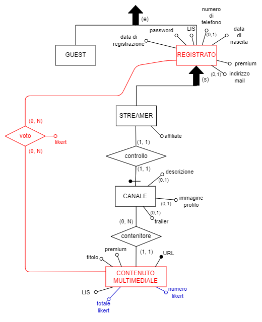

##### 2.3.1.1.1 DERIVAZIONE

L'attributo **_numero likert_** dell'entità `CONTENUTO MULTIMEDIALE` é derivabile dal conteggio delle partecipazioni di un contenuto multimediale all'associazione `voto`.

L'attributo **_totale likert_** dell'entità `CONTENUTO MULTIMEDIALE` é derivabile dalla somma dei valori dell'attributo **_likert_** dell'associazione `voto` di tutte le partecipazioni di un contenuto multimediale a questa associazione.

##### 2.3.1.1.2 OPERAZIONI COINVOLTE

| Operazione | Descrizione                                                                                                  | Tipo | Frequenza           |
| ---------- | ------------------------------------------------------------------------------------------------------------ | ---- | ------------------- |
| Op3        | Per ogni streamer, calcola la media dei voti per ogni contenuto multimediale                                 | B    | Una volta al giorno |
| Op4        | Gli amministratori, per ogni contenuto multimediale di ogni streamer, stilano il rating dei video più votati | B    | Una volta al giorno |

##### 2.3.1.1.3 PRESENZA DI RIDONDANZA

###### 2.3.1.1.3.1 Op3

Schema di operazione:  

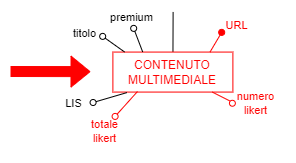

Tavola degli accessi:

| Concetto               | Costrutto | Accessi | Tipo | Descrizione                                                                             |
| ---------------------- | --------- | ------- | ---- | --------------------------------------------------------------------------------------- |
| CONTENUTO MULTIMEDIALE | E         | 1       | L    | Leggo il punteggio totale in likert e il numero di voti per ogni contenuto multimediale |

La media dei voti di ogni contenuto multimediale si ottiene dividendo il punteggio totale in likert (**_totale likert_**) per il numero di voti (**_numero likert_**) ricevuti.

| Costo | Valori                   |
| ----- | ------------------------ |
| S:    | 0 accessi/giorno         |
| L:    | 1 * 1 = 1 accesso/giorno |
| TOT:  | 1 accesso/giorno         |

###### 2.3.1.1.3.1 Op4

Schema di operazione:

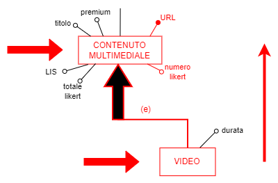

Tavola degli accessi:

| Concetto               | Costrutto | Accessi | Tipo | Descrizione                                          |
| ---------------------- | --------- | ------- | ---- | ---------------------------------------------------- |
| VIDEO                  | E         | 1       | L    | Prendo tutti i contenuti multimediali che sono video |
| CONTENUTO MULTIMEDIALE | E         | 200,000 | L    | Leggo il numero di likert per ogni video             |

I video più votati saranno quelli con il maggiore numero di voti ricevuti.

| Costo | Valori                                     |
| ----- | ------------------------------------------ |
| S:    | 0 accessi/giorno                           |
| L:    | (200,000 + 1) * 1 = 200,001 accessi/giorno |
| TOT:  | 200,000 accessi/giorno circa               |

##### 2.3.1.1.4 ASSENZA DI RIDONDANZA

###### 2.3.1.1.4.1 Op3

Schema di operazione:

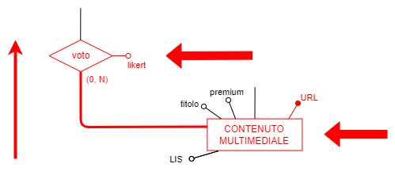

Tavola degli accessi:

| Concetto               | Costrutto | Accessi                   | Tipo | Descrizione                                                                             |
| ---------------------- | --------- | ------------------------- | ---- | --------------------------------------------------------------------------------------- |
| CONTENUTO MULTIMEDIALE | E         | 1                         | L    | Prendo tutti i contenuti multimediali                                                   |
| voto                   | A         | 1,400,000/1,000,000 = 1.4 | L    | Leggo quante volte e con quale punteggio ogni contenuto ha partecipato all'associazione |

La media di voti di ogni contenuto multimediale si otterrà dividendo la somma di tutti i punteggi per il numero di partecipazioni all'associazione `voto`.

| Costo | Valori                             |
| ----- | ---------------------------------- |
| S:    | 0 accessi/giorno                   |
| L:    | (1 + 1.4) * 1 = 2.4 accessi/giorno |
| TOT:  | poco più di 2 accessi/giorno       |

###### 2.3.1.1.4.1 Op4

Schema di operazione:

Tavola degli accessi:

| Concetto               | Costrutto | Accessi               | Tipo | Descrizione                                          |
| ---------------------- | --------- | --------------------- | ---- | ---------------------------------------------------- |
| VIDEO                  | E         | 1                     | L    | Prendo tutti i contenuti multimediali che sono video |
| CONTENUTO MULTIMEDIALE | E         | 1                     | L    | Leggo tutti gli URL dei video                        |
| voto                   | A         | 1,400,000/200,000 = 7 | L    | Leggo il voto in likert di ogni video                |

I video più votati saranno quelli con il maggiore numero di partecipazioni all'associazione `voto`.

| Costo | Valori              |
| ----- | ------------------- |
| S:    | 0 accessi/giorno    |
| L:    | (1 + 1 + 7) * 1 = 9 |
| TOT:  | 9 accesso/giorno    |

##### 2.3.1.1.5 TOTALI PER RIDONDANZA 1

Assumendo che gli attributi **_numero likert_** e **_totale likert_** occupino ciascuno 4 byte, si ottengono i seguenti valori:

| **Presenza di ridondanza** |                                   |
| -------------------------- | --------------------------------- |
| Spazio:                    | 4 * 2 * 1,000,000 Byte aggiuntivi |
| Tempo:                     | 200,000 accessi/giorno circa      |

| **Assenza di ridondanza** |                         |
| ------------------------- | ----------------------- |
| Spazio:                   | 0                       |
| Tempo:                    | 11 accessi/giorno circa |

##### 2.3.1.1.6 Decisione

<!--Questa ridondanza risulta inutile in quanto non risparmia nemmeno un singolo accesso sprecando circa 7.6 MB.
Per questo motivo, si decide di eliminare la ridondanza togliendo i due attributi **_numero likert_** e **_totale likert_**.-->

Questa ridondanza richiede molti accessi al giorno e uno spreco di circa 8 MB: per questo motivo, si decide di eliminare questa ridondanza togliendo gli attributi **_numero likert_** e **_totale likert_** all'entità `CONTENUTO MULTIMEDIALE`.

#### 2.3.1.2 RIDONDANZA 2 (ridondanza dell'affluenza media)

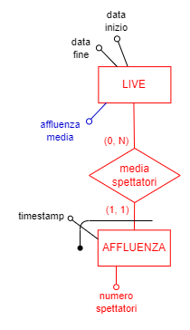

##### 2.3.1.2.1 DERIVAZIONE

<!--L'attributo "affluenza media" dell'entità `LIVE` é derivabile dalla somma dei valori dell'attributo **_numero spettatori_** dell'entità `AFFLUENZA` diviso il numero di affluenze calcolate a partire dall'inizio della live (**_data inizio_**).-->

L'attributo **_affluenza media_** dell'entità `LIVE` é derivabile dalla partecipazione di una live del mese corrente all'associazione `media spettatori` non appena la live termina.

##### 2.3.1.2.2 OPERAZIONI COINVOLTE

| Operazione | Descrizione                                                                            | Tipo | Frequenza         |
| ---------- | -------------------------------------------------------------------------------------- | ---- | ----------------- |
| Op9        | Per ogni streamer, stilare la media degli spettatori per ogni live uscita in quel mese | B    | Una volta al mese |

##### 2.3.1.2.3 PRESENZA DI RIDONDANZA

###### 2.3.1.2.3.1 Op9

Schema di operazione:

Tavola degli accessi:

| Concetto | Costrutto | Accessi | Tipo | Descrizione                                                                                          |
| -------- | --------- | ------- | ---- | ---------------------------------------------------------------------------------------------------- |
| LIVE     | E         | 1       | L    | Leggo l'affluenza media e la data di inizio di ogni live, considerando solo quelle del mese corrente |

| Costo | Valori                 |
| ----- | ---------------------- |
| S:    | 0                      |
| L:    | 1 * 1 = 1 accesso/mese |
| TOT:  | 1 accesso/mese         |

##### 2.3.1.2.4 ASSENZA DI RIDONDANZA

###### 2.3.1.2.4.1 Op9

Schema di operazione:

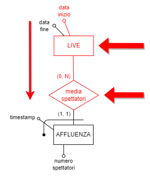

Tavola degli accessi:

| Concetto         | Costrutto | Accessi             | Tipo | Descrizione                                                                    |
| ---------------- | --------- | ------------------- | ---- | ------------------------------------------------------------------------------ |
| LIVE             | E         | 1                   | L    | Leggo la data di inizio di ogni live e considero solo quelle del mese corrente |
| media spettatori | A         | 500,000/250,000 = 2 | L    | Cerco la media di spettatori per ogni live del mese corrente                   |

| Costo | Valori                       |
| ----- | ---------------------------- |
| S:    | 0                            |
| L:    | (1 + 2) * 1 = 3 accessi/mese |
| TOT:  | 3 accessi/mese               |

###### 2.3.1.2.5 TOTALI PER RIDONDANZA 2

Assumendo che l'attributo **_affluenza media_** occupi 4 byte, si ottengono i seguenti valori:

| **Presenza di ridondanza** |                               |
| -------------------------- | ----------------------------- |
| Spazio:                    | 4 * 1 * 250,000 Byte occupati |
| Tempo:                     | 1 accesso/mese                |

| **Assenza di ridondanza** |                      |
| ------------------------- | -------------------- |
| Spazio:                   | 0                    |
| Tempo:                    | 3 accessi/mese 3 |

###### 2.3.1.2.6 Decisione

In conclusione, si evidenzia uno spreco di 1 MB solamente per diminuire il numero di accessi mensili: per questo motivo, si decide di togliere la ridondanza eliminando l'attributo **_affluenza media_** dell'entità `LIVE`.

### 2.3.2 Eliminazione delle generalizzazioni

Nel processo di ristrutturazione, ci concentreremo sull'analisi e sulla rimozione delle seguenti generalizzazioni:

- **generalizzazione dell'utente**
- **generalizzazione del contenuto multimediale**
- **generalizzazione dell'interazione utenti-contenuto multimediale**

#### 2.3.2.1 Generalizzazione 1 (generalizzazione dell'utente)

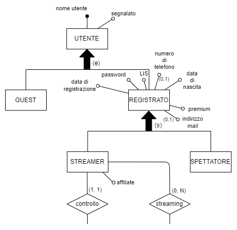

Dallo schema E-R concettuale, si può notare che le entità figlie `GUEST`, `STREAMER` e `SPETTATORE` o non hanno attributi oppure ne hanno solamente uno.
Ci si concentra ora sulle ultime due entità figlie, `STREAMER` e `SPETTATORE`: non sono effettivamente delle entità, ma dei ruoli che l'entità padre `REGISTRATO` può assumere di tanto in tanto.
Le due entità quindi possono essere incorporate nell'entità padre `REGISTRATO` senza aggiungere attributi "tipo", siccome il loro ruolo è facilmente intuibile dalle azioni di un utente registrato.

La cardinalità della partecipazione dell'entità `REGISTRATO` all'associazione `controllo` viene di conseguenza aggiornata a (0,1), siccome solo uno streamer può avere un canale, mentre uno spettatore può non averlo.

Le altre partecipazioni e relative cardinalità rimangono invece inalterate.

L'attributo **_affiliate_** che prima era dell'entità figlia `STREAMER` viene ora trasferito all'entità padre, ma con cardinalità (0,1) siccome la qualifica di affiliate può essere assegnata solo ad un utente streamer.

Viene inoltre imposto il vincolo che solo uno streamer può partecipare all'associazione `streaming`.

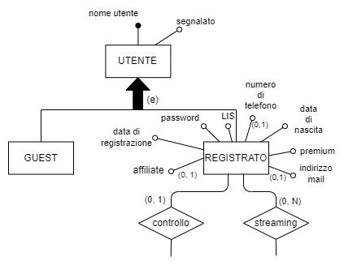

Adesso ci si concentra sull'entità `GUEST` senza attributi rimasta:

qui risulta controproducente incorporare le entità figlie `GUEST` e `REGISTRATO` nell'entità padre `UTENTE`, in quanto si creerebbero degli sprechi di spazio producendo una base dati denormalizzata con valori nulli per colpa di `GUEST`.

Si decide quindi di incorporare solamente l'entità `GUEST` nell'entità padre in quanto per identitficare un'utente guest basta solamente un nome utente univoco.

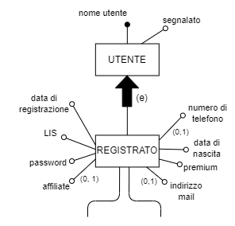

Ora rimane solo l'entità figlia `REGISTRATO`: avendo numerosi attributi, per evitare di incorporarla nell'entità padre causando uno spreco di spazio scritto precedentemente, si sostituisce la generalizzazione con l'associazione **_partizione_**.

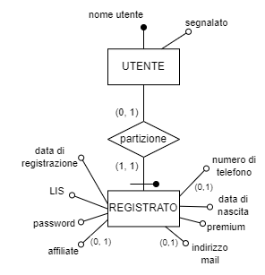

Avendo ora due entità si crea una divisione tra le due sui permessi, per fare in modo che l'entità `UTENTE` comprenda sia utenti guest che utenti registrati e possa essere utilizzata per permettere solamente la visualizzazione dei contenuti multimediali, vietando qualsiasi altra azione ai guest.
L'entità `REGISTRATO` invece viene utilizzata per compiere azioni riservate agli utenti registrati.

##### 2.3.2.1.1 Regole aziendali introdotte

- RVI: Solo un utente registrato che ha un canale (streamer) può avere l'attributo **_affiliate_**.
- RVII: Solo uno streamer può partecipare all'associazione **_streaming_**.

#### 2.3.2.2 Generalizzazione 2 (generalizzazione del contenuto multimediale)

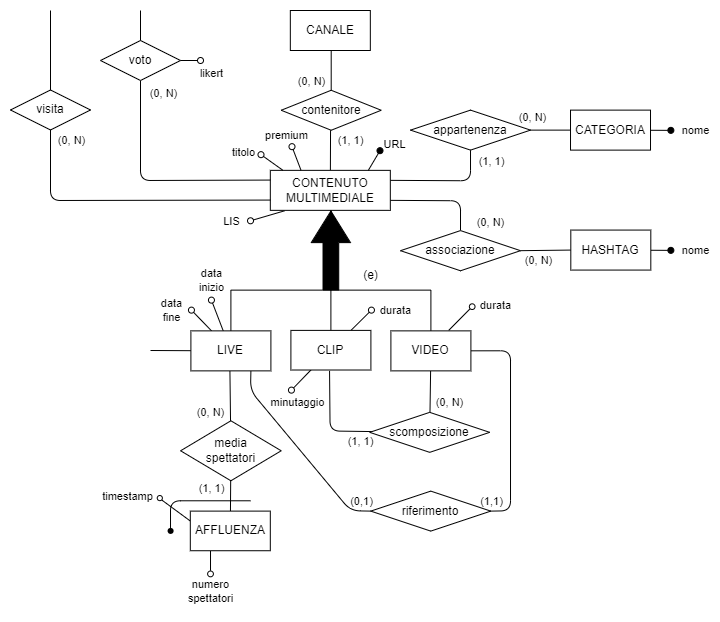

Dallo schema ER (considerato dopo l'eliminazione delle ridondanze), si può notare che la generalizzazione è totale ed esclusiva: le operazioni fanno ampiamente distinzione tra le entità figlie e a dimostrazione di ciò si ha la presenza di associazioni che coinvolgono le entità figlie separatamente; l'entità genitore però viene utilizzata in alcune operazioni più generiche, come ad esempio il calcolo della media dei voti di ogni contenuto multimediale, indipendentemente che esso sia un video, una clip o una live.

Essendo le entità figlie delle specializzazioni dell'entità padre `CONTENUTO MULTIMEDIALE` e avente quest'ultima pochi attributi, si potrebbe pernsare di accorpare ad esse l'entità genitore.

Questo però causerebbe almeno due problemi:

 1) l'aggiunta alle entità figlie di ogni associazione a cui l'entità padre partecipa, triplicando quindi il numero di associazioni    corrispondenti a `voto`, `visita`, `appartenenza`, `associazione(CM-H)` e `contenitore`;
 2) l'aumento degli accessi alle entità figlie e alle relative associazioni per operazioni che coinvolgono un contenuto multimediale in modo generico.

Se invece si decidesse di accorpare le entità figlie all'entità padre, questo procedimento porterebbe anche all'introduzione di associazioni ricorsive e alla presenza di molti valori nulli (nonchè l'aggiunta di molti vincoli), ottenendo una base di dati denormalizzata e un notevole spreco di spazio in memoria (considerando anche i volumi dell'entità `CONTENUTO MULTIMEDIALE`).

Anche se potrebbe generare più accessi, si decide infine di sostituire la generalizzazione con associazioni (**_contenuto live_**, **_contenuto video_** e **_contenuto clip_**), siccome questo procedimento produce entità con pochi attributi e garantisce il recupero di molti dati con un unico accesso a livello fisico.

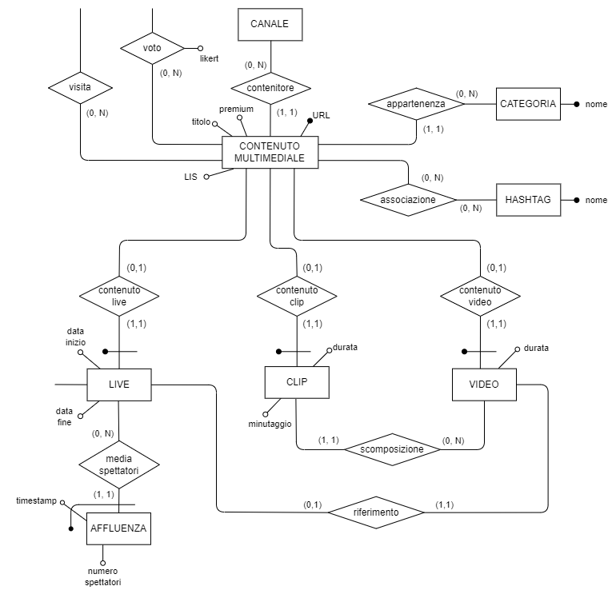

Tutte e tre le nuove associazioni hanno cardinalità (0,1) e (1,1) e le entità `LIVE`, `VIDEO` e `CLIP` sono identificate esternamente dall'entità `CONTENUTO MULTIMEDIALE`.

Si aggiunge anche un vincolo di partecipazione alle tre nuove associazioni, in quanto un occorrenza di `CONTENUTO MULTIMEDIALE` non può partecipare a più di una associazione per volta: un contenuto multimediale deve infatti essere un video, una live o una clip.

##### 2.3.2.2.1 Regole aziendali introdotte

- RVI: un contenuto multimediale non può partecipare a più di una associazione alla volta tra le associazioni **_contenuto live_**, **_contenuto video_** e **_contenuto clip_**.

#### 2.3.2.3 Generalizzazione 3 (generalizzazione dell'interazione utenti-contenuto multimediale)

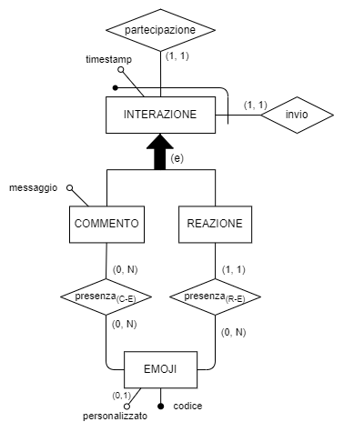

Dallo schema ER, si nota subito che le entità figlie partecipano entrambe ad una associazione con la medesima entità `EMOJI`.

Inoltre, le operazioni che coinvolgono la generalizzazione non fanno molta distinzione tra le occorrenze delle varie entità, specialmente considerando che un commento e una reazione possono essere viste come una generica interazione sia rispetto all'utente che la crea che alla live che la riceve.

Un aspetto degno di nota è la presenza di un attributo solo nell'entità `COMMENTO` che, anche se potrebbe occupare spazio, non ha corrispondenti nell'entità `REAZIONE`.

Infine, si possono osservare le cardinalità in gran parte identiche con le quali le entità figlie vengono associate all'entità `EMOJI`: possono infatti essere uniformate a (0,N) grazie all'introduzione di vincoli, permettendo la fusione delle associazioni `presenza(C-E)` e `presenza(R-E)` in una sola associazione **_presenza_**.

Per questi motivi, si sceglie di accorpare le entità figlie nell'entità genitore `INTERAZIONE`.

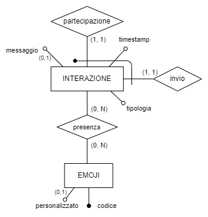

Per distinguere un commento da una reazione, è stato introdotto l'attributo **_tipologia_** e si impone il vincolo che un'interazione di tipo **_reazione_** partecipi all'associazione **_presenza_** solamente con cardinalità (1,1).

L'unico attributo dell'entità `COMMENTO` è stato quindi trasferito all'entità `INTERAZIONE`, ma reso opzionale, in quanto non necessario per una reazione.

Anche se questa scelta può portare a valori nulli e a uno spreco di spazio, permette però di ridurre notevolmente il numero di accessi a entità e associazioni e di semplificare le operazioni.

##### 2.3.2.3.1 Regole aziendali introdotte

- RVI: una reazione può partecipare all'associazione **_presenza_** solamente con cardinalità (1,1).

### 2.3.3 Partizionamento/accorpamento di entità e associazioni

Nello schema ER, considerato dopo l'eliminazione delle ridondanze e delle generalizzazioni, non sono stati individuati concetti da partizionare o accorpare.

### 2.3.4 Scelta degli identificatori principali

| Entità                 | Identificatore principale   |
| ---------------------- | --------------------------- |
| UTENTE                 | nome utente                 |
| REGISTRATO             | nome utente                 |
| PORTAFOGLIO            | nome utente                 |
| MESSAGGIO              | timestamp, nome utente      |
| CANALE                 | nome utente                 |
| LINK SOCIAL            | social, nome utente         |
| AMMINISTRATORE         | codice                      |
| PROVIDER               | nome provider               |
| PROGRAMMAZIONE         | timestamp, nome utente      |
| CONTENUTO MULTIMEDIALE | URL                         |
| LIVE                   | URL                         |
| CLIP                   | URL                         |
| VIDEO                  | URL                         |
| EMOJI                  | codice                      |
| CATEGORIA              | nome                        |
| HASHTAG                | nome                        |
| INTERAZIONE            | nome utente, URL, timestamp |
| AFFLUENZA              | timestamp, URL              |

Gli identificatori rappresentati nello schema ristrutturato sono tutti costituiti da pochi attributi e verranno quindi considerati tutti come chiavi primarie nello schema relazionale.

Molte entità hanno identitficatori esterni, ma costituiti da pochi attributi: per questo motivo si è deciso di mantenerli e di considerarli come chiavi primarie.
Unica eccezione a questa decisione risulta essere l'entità `CONTENUTO MULTIMEDIALE`: questa entità infatti avrebbe avuto un identificatore composto da quattro attributi (uno dei quali esterno) e ciò avrebbe complicato la traduzione in schema logico, causando la propagazione del suo lungo identificatore anche alle entità che essa stessa avrebbe identificato. Per queste ragioni, si è deciso di considerare come identificatore soltanto l'attributo **_URL_**, essendo un URL già di per sè un identificatore univoco.

## 2.4 Schema E-R ristrutturato + regole aziendali

### 2.4.1 Regole aziendali

### 2.4.2 Vincoli di Integrità

| RVI  | \<concetto\> deve/non deve \<espressione\>                                                                                                                                                 |
| ---- | ------------------------------------------------------------------------------------------------------------------------------------------------------------------------------------------ |
| RV1  | Uno streamer deve essere un utente registrato al servizio e avere un canale.                                                                                                               |
| RV2  | Uno spettatore non deve avere l'attributo **_affiliate_**.                                                                                                                                 |
| RV3  | Uno spettatore non deve partecipare all'associazione **_streaming_**.                                                                                                                      |
| RV4  | Un messaggio deve avere un mittente e un destinatario.                                                                                                                                     |
| RV5  | Un canale deve essere gestito da un amministratore.                                                                                                                                        |
| RV6  | Il "nome utente" dell'utente guest deve essere composto dalla stringa 'guest_' piú l'UUID.                                                                                                 |
| RV7  | Un contenuto multimediale non deve partecipare contemporaneamente alle associazioni **_contenuto live_**, **_contenuto video_** e **_contenuto clip_**, ma solo ad una di esse alla volta. |
| RV8  | Una reazione deve partecipare all'associazione **_presenza_** solamente con cardinalità (1,1)                                                                                              |
| RV9  | Ogni video deve essere associato ad una live per poter esistere.                                                                                                                           |
| RV10 | Ogni clip deve essere associata ad un video per poter esistere.                                                                                                                            |
| RV11 | La durata di una clip deve essere inferiore a quella di un video.                                                                                                                          |
| RV12 | Il voto ai contenuti multimediali di uno streamer deve essere concesso solo ai suoi follower.                                                                                              |

### 2.4.3 Derivazioni

| RDI | \<concetto\> si ottiene \<operazione\>                                                                                                              |
| --- | --------------------------------------------------------------------------------------------------------------------------------------------------- |
| RD1 | Il numero totale di follower si ottiene sommando tutti gli utenti registrati che seguono il canale.                                                 |
| RD2 | Il numero di visualizzazioni di una clip o di un video si ottiene sommando tutti gli utenti (registrati e non) che hanno visualizzato il contenuto. |
| RD3 | Il numero totale di minuti trasmessi da uno streamer si ottiene sommando la durata di ogni live del canale.                                         |
| RD4 | Il permesso di voto si ottiene verificando che lo spettatore sia un utente registrato al servizio e che segua il canale.                            |
| RD5 | La popolarità di un contenuto multimediale si ottiene contando il numero di visualizzazioni e interazioni ricevute.                                 |
| RD6 | L'affluenza media di una live si ottiene dividendo l'affluenza totale per il numero di affluenze momentanee calcolate durante la live.              |
| RD7 | Il numero di interazioni si ottiene sommando tutte le interazioni ricevute da un contenuto multimediale.                                            |
| RD8 | La media di voti di un contenuto multimediale si ottiene dividendo il punteggio totale dei voti del contenuto per il numero di voti ricevuti.       |

## 2.5 Schema relazionale con vincoli di integrità referenziale

> <Relazione1 (Identificatore, Attributo1, …)>
> <Relazione2 (Identificatore, Attributo1, …) Relazione2 (Attributo1) referenzia Relazionex (Attributoy)>
> <Relazione3 (Identificatore, Attributo1, …)>

Utente(<U>NomeUtente</U>)

Registrato(<U>Username</U>, UserPassword, DataDiNascita, DataRegistrazione, NumeroDiTelefono*, IndirizzoMail*, Affiliate*, Premium, LIS)  
> Registrato(Username) referenzia Utente(NomeUtente)  

Messaggio(<U>Mittente</U>, <U>TimestampMessaggio</U>, Destinatario, Testo)  
> Messaggio(Mittente) referenzia Registrato(Username)  
> Messaggio(Destinatario) referenzia Registrato(Username)  

Portafoglio(<U>UtenteProprietario</U>, TotaleBits)  
> Portafoglio(UtenteProprietario) referenzia Registrato(Username)  

Donazione(<U>ProprietarioPortafoglio</U>, <U>CanaleStreamer</U>, Timestamp, Bits)  
> Donazione(ProprietarioPortafoglio) referenzia Portfoglio(UtenteProprietario)  
> Donazione(CanaleStreamer) referenzia Canale(UtenteProprietario)  

Canale(<U>StreamerProprietario</U>, AdminCanale, HostingProvider, Descrizione*, ImmagineProfilo*, Trailer*)  
> Canale(StreamerProprietario) referenzia Registrato(Username)  
> Canale(AdminCanale) referenzia Amministratore(CodiceAdmin)  
> Canale(HostingProvider) referenzia Provider(NomeProvider)

Amministratore(<U>CodiceAdmin</U>, Nome, Cognome)  

Provider(<U>NomeProvider</U>)

Rinnovo(<U>Amministratore</U>, <U>Provider</U>, Scadenza, Pagato)  
> Rinnovo(Amministratore) referenzia Amministratore(CodiceAdmin)  
> Rinnovo(Provider) referenzia Provider(NomeProvider)

Programmazione(<U>Streamer</U>, <U>ProgTimestamp</U>, Titolo, LIS, Premium)  
> Programmazione(Streamer) referenzia Registrato(Username)  

Abbonamento(<U>UtenteAbbonato</U>, <U>Streamer</U>)  
> Abbonamento(UtenteAbbonato) referenzia Registrato(Username)  
> Abbonamento(Streamer) referenzia Canale(StreamerProprietario)  

Follower(<U>UtenteFollower</U>, <U>StreamerSeguito</U>)  
> Follower(UtenteFollower) referenzia Registrato(Username)  
> Follower(StreamerSeguito) referenzia Canale(StreamerProprietario)  

LinkSocial(<U>CanaleAssociato</U>, <U>Social</U>, LinkProfilo)  
> LinkSocial(CanaleAssociato) referenzia Canale(StreamerProprietario)  

ContenutoMultimediale(<U>IdURL</U>, Canale, Titolo, Categoria, LIS)  
> ContenutoMultimediale(Canale) referenzia Canale(StreamerProprietario)  
> ContenutoMultimediale(Categoria) referenzia Categoria(NomeCategoria)  

Voto(<U>UtenteRegistrato</U>, <U>ContenutoMultimediale</U>, Likert)  
> Voto(UtenteRegistrato) referenzia Registrato(Username)  
> Voto(ContenutoMultimediale) referenzia ContenutoMultimediale(IdURL)

Visita(<U>Utente</U>, <U>ContenutoMultimediale</U>)  
> Visita(Utente) referenzia Utente(NomeUtente)  
> Visita(ContenutoMultimediale) referenzia ContenutoMultimediale(IdURL)  

Categoria(<U>NomeCategoria</U>)

Hashtag(<U>NomeHashtag</U>)

AssociazioneCM_H(<U>Hashtag</U>, <U>ContenutoMultimediale</U>)  
> AssociazioneCM_H(Hashtag) referenzia Hashtag(NomeHashtag)  
> AssociazioneCM_H(ContenutoMultimediale) referenzia ContenutoMultimediale(IdURL)

Live(<U>IdLive</U>, DataInizio, DataFine, Premium)
> Live(IdLive) referenzia ContenutoMultimediale(IdURL)

Clip(<U>IdClip</U>, Durata, Minutaggio, Video)  
> Clip(IdClip) referenzia ContenutoMultimediale(IdURL)  
> Clip(Video) referenzia Video(IdVideo)  

Video(<U>IdVideo</U>, Durata, Live)  
> Video(IdVideo) referenzia ContenutoMultimediale(IdURL)  
> Video(Live) referenzia Live(IdLive)

Affluenza(<U>Live</U>, <U>TimestampAffluenza</U>, NumeroSpettatori)  
> Affluenza(Live) referenzia Live(IdLive)  

Interazione(<U>Spettatore</U>, <U>LiveCorrente</U>, <U>IntTimestamp</U>, Tipologia, Messaggio*)  
> Interazione(Spettatore) referenzia Registrato(Username)  
> Interazione(LiveCorrente) referenzia Live(IdLive)

Emoji(<U>Codice</U>)
  
Presenza(<U>SpettatoreLive</U>, <U>LiveAssociata</U>, <U>TimestampInt</U>, <U>CodiceEmoji</U>)  
> Presenza(SpettatoreLive) referenzia Interazione(Spettatore)  
> Presenza(LiveAssociata) referenzia Interazione(LiveCorrente)  
> Presenza(TimestampInt) referenzia Interazione(IntTimestamp)  
> Presenza(CodiceEmoji) referenzia Emoji(Codice)  
